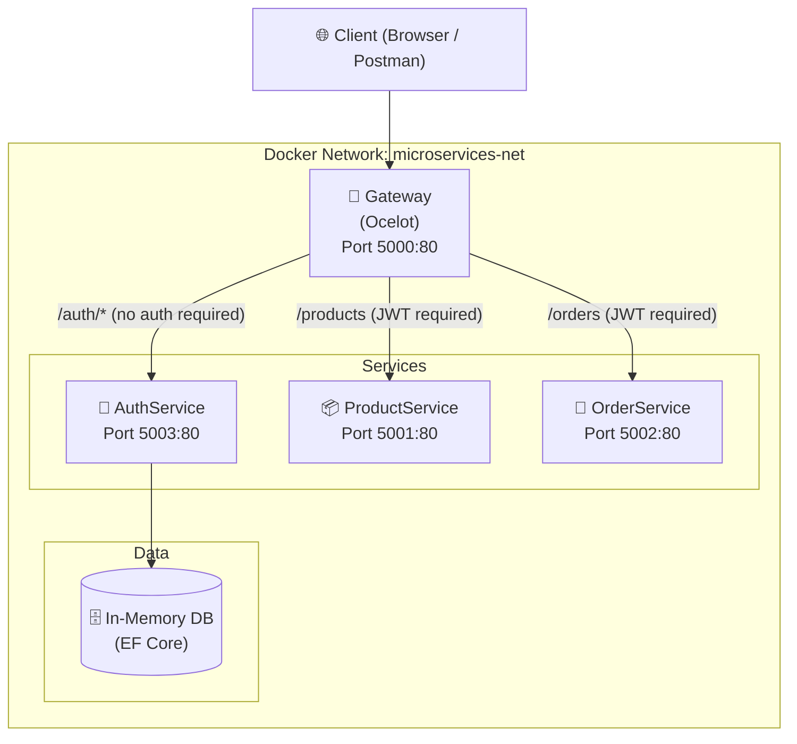
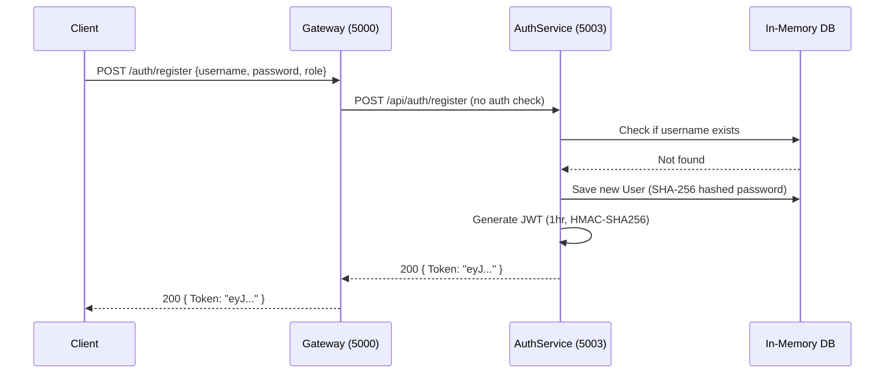
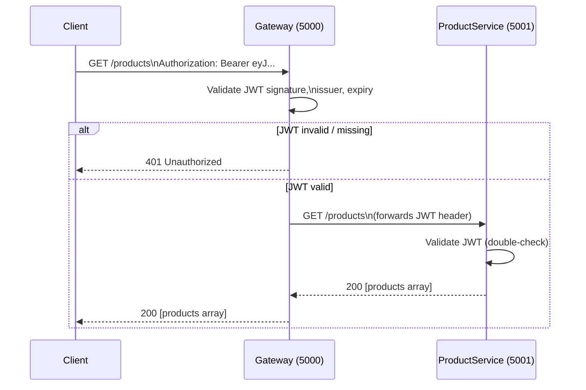
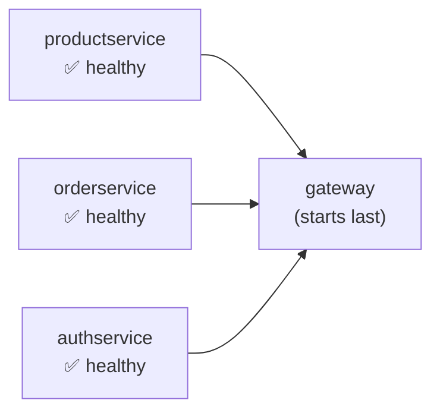

# MicroserviceTutorial — Architecture & Developer Guide

## Overview

**MicroserviceTutorial** is a learning project that demonstrates a classic microservices pattern using **ASP.NET Core 8** (.NET 8). It consists of four independently deployable services orchestrated via Docker Compose, with a centralized API Gateway as the single entry point for all external traffic.

---

## System Architecture



---

## Services

### 1. Gateway (`Gateway/`)

| Property | Value |
|---|---|
| Framework | ASP.NET Core 8 |
| Router | **Ocelot** API Gateway |
| Port (host) | `5000` → container `80` |
| Auth | Validates JWTs issued by AuthService |

The Gateway is the **single entry point** for all client requests. It:
- Routes requests to the correct downstream service based on path templates defined in [`ocelot.json`](file:///c:/Users/Lokesh/source/repos/MicroserviceTutorial/Gateway/ocelot.json)
- Enforces JWT authentication on protected routes before forwarding them
- Applies CORS policy `AllowAll`
- Logs every incoming request method + path to the console

#### Key file: [`ocelot.json`](file:///c:/Users/Lokesh/source/repos/MicroserviceTutorial/Gateway/ocelot.json)

| Upstream Path | HTTP Methods | Downstream Service | Auth Required |
|---|---|---|---|
| `/auth/{everything}` | GET, POST | `authservice:80/api/auth/{everything}` | ❌ No |
| `/products` | GET | `productservice:80/products` | ✅ Bearer JWT |
| `/products/{id}` | GET | `productservice:80/products/{id}` | ✅ Bearer JWT |
| `/orders` | GET | `orderservice:80/orders` | ✅ Bearer JWT |
| `/orders/{id}` | GET | `orderservice:80/orders/{id}` | ✅ Bearer JWT |

---

### 2. AuthService (`AuthService/`)

| Property | Value |
|---|---|
| Framework | ASP.NET Core 8 |
| Database | EF Core **In-Memory** (`AuthDb`) |
| Port (host) | `5003` → container `80` |
| JWT Secret | `"this_is_my_super_secret_key_for_auth_service"` |
| JWT Issuer | `"AuthService"` |
| Token Expiry | 1 hour |

This service owns **user identity**. It handles registration, login, and token validation. It is the **only issuer** of JWT tokens in the system.

#### Internal Structure

```
AuthService/
├── Controllers/
│   ├── AuthController.cs    ← REST endpoints
│   └── HealthController.cs  ← Docker healthcheck endpoint
├── Data/
│   └── AuthDbContext.cs     ← EF Core context + seed data
├── Models/
│   └── User.cs              ← User entity
├── Services/
│   ├── IAuthService.cs      ← Interface
│   └── AuthService.cs       ← Business logic (JWT, hashing)
└── Program.cs               ← DI registration, middleware
```

#### Data Model

```csharp
public class User
{
    public int    Id           { get; set; }
    public string Username     { get; set; }
    public string PasswordHash { get; set; }  // SHA-256, Base64
    public string Role         { get; set; }  // "User" | "Admin"
}
```

#### Seed Data (always present on startup)

| Id | Username | Password | Role |
|---|---|---|---|
| 1 | `admin` | `admin` | `Admin` |

#### API Endpoints

| Method | Path | Auth | Description |
|---|---|---|---|
| `POST` | `/api/auth/register` | ❌ | Register a new user, returns JWT |
| `POST` | `/api/auth/login` | ❌ | Login, returns JWT |
| `POST` | `/api/auth/validate` | ❌ | Validate a JWT token |
| `GET` | `/api/auth` | ❌ | List all registered users |
| `GET` | `/health` | ❌ | Docker healthcheck |

#### Password Hashing

Passwords are hashed with **SHA-256** (raw bytes → Base64 string). There is no salting — this is a tutorial project and not production-hardened.

#### JWT Token Contents

Each token contains three claims:
- `ClaimTypes.NameIdentifier` — user `Id`
- `ClaimTypes.Name` — `Username`
- `ClaimTypes.Role` — `Role` (`"User"` or `"Admin"`)

The token is signed with **HMAC-SHA256** using the shared symmetric key.

---

### 3. ProductService (`ProductService/`)

| Property | Value |
|---|---|
| Framework | ASP.NET Core 8 |
| Storage | Static in-memory list (no DB) |
| Port (host) | `5001` → container `80` |
| Auth | Validates JWTs (same secret/issuer as AuthService) |

Exposes a read-only product catalog. All endpoints require a valid JWT.

#### Internal Structure

```
ProductService/
├── Controllers/
│   ├── ProductsController.cs  ← REST endpoints
│   └── HealthController.cs    ← Docker healthcheck (10s warmup)
├── Models/
│   └── Product.cs
└── Program.cs
```

#### Data Model

```csharp
public class Product
{
    public int     Id    { get; set; }
    public string  Name  { get; set; }
    public decimal Price { get; set; }
}
```

#### Seeded Products (in-memory static list)

| Id | Name | Price |
|---|---|---|
| 1 | Laptop | $999.90 |
| 1 | Mouse | $24.90 |
| 1 | Keyboard | $49.90 |

> [!NOTE]
> All three products share `Id = 1` — this appears to be a bug in the tutorial code. The `GetProduct(int id)` endpoint will always return "Laptop" when queried by id.

#### API Endpoints

| Method | Path | Roles | Description |
|---|---|---|---|
| `GET` | `/products` | Admin, User | List all products |
| `GET` | `/products/{id}` | Admin, User | Get product by id |
| `GET` | `/health` | — | Docker healthcheck |

---

### 4. OrderService (`OrderService/`)

| Property | Value |
|---|---|
| Framework | ASP.NET Core 8 |
| Storage | Static in-memory list (no DB) |
| Port (host) | `5002` → container `80` |
| Auth | Validates JWTs (same secret/issuer) |

Exposes a read-only order list. Unlike ProductService, the `[Authorize]` attribute is **not** applied at the controller level in the current code — the gateway handles the auth enforcement for the `/orders` route.

#### Internal Structure

```
OrderService/
├── Controllers/
│   ├── OrdersController.cs  ← REST endpoints
│   └── HealthController.cs  ← Docker healthcheck
├── Models/
│   └── Order.cs
└── Program.cs
```

#### Data Model

```csharp
public record Order(int Id, int ProductId, int Quantity, DateTime OrderDate);
```

#### Seeded Orders (in-memory static list)

| Id | ProductId | Quantity | OrderDate |
|---|---|---|---|
| 1 | 1 | 2 | Yesterday |
| 2 | 2 | 3 | 2 hours ago |

#### API Endpoints

| Method | Path | Auth | Description |
|---|---|---|---|
| `GET` | `/orders` | Via Gateway | List all orders |
| `GET` | `/orders/{id}` | Via Gateway | Get order by id |
| `GET` | `/health` | — | Docker healthcheck |

---

## Authentication & Authorization Flow

### Token Issuance (Register / Login)



### Authenticated Request Flow



---

## Shared JWT Configuration

Both the Gateway and downstream services share the **same JWT secret** hardcoded as:

```
"this_is_my_super_secret_key_for_auth_service"
```

This means the Gateway validates the token at the edge, and each service can also validate independently. The JWT issuer is `"AuthService"`.

> [!WARNING]
> The JWT secret is hardcoded in `appsettings.json` files. For production, this must be moved to environment variables or a secrets manager.

---

## Docker Deployment

The entire application is containerized and orchestrated via [`docker-compose.yml`](file:///c:/Users/Lokesh/source/repos/MicroserviceTutorial/docker-compose.yml).

### Network Topology

All containers communicate over a single bridge network: **`microservices-net`**. Service discovery uses Docker DNS (container names as hostnames).

### Container Summary

| Service | Image | Host Port | Container Port | Healthcheck Endpoint |
|---|---|---|---|---|
| gateway | `gateway` | 5000 | 80 | N/A |
| productservice | `productservice` | 5001 | 80 | `GET /health` |
| orderservice | `orderservice` | 5002 | 80 | `GET /health` |
| authservice | `authservice` | 5003 | 80 | `GET /health` |

### Startup Dependency Order



The gateway waits for all three services to report `healthy` before starting. The ProductService HealthController deliberately fails health checks for the **first 10 seconds** after startup to simulate a warmup period.

### Build Strategy

Each service uses a **multi-stage Dockerfile**:
1. **`build`** stage: `mcr.microsoft.com/dotnet/sdk:8.0` — restores NuGet packages, compiles
2. **`publish`** stage: runs `dotnet publish`
3. **`final`** stage: `mcr.microsoft.com/dotnet/aspnet:8.0` — lean runtime image

---

## Complete Request Flow Diagrams

### Flow 1: User Registration

```mermaid
sequenceDiagram
    Client->>Gateway:5000: POST /auth/register\n{"username":"alice","password":"pw123","role":"User"}
    Gateway:5000->>AuthService:5003: POST /api/auth/register
    AuthService:5003->>AuthService:5003: Hash password (SHA-256)
    AuthService:5003->>InMemoryDB: INSERT User
    AuthService:5003->>AuthService:5003: Create JWT (id, name, role claims)
    AuthService:5003-->>Gateway:5000: 200 {"Token":"eyJ..."}
    Gateway:5000-->>Client: 200 {"Token":"eyJ..."}
```

### Flow 2: User Login

```mermaid
sequenceDiagram
    Client->>Gateway:5000: POST /auth/login\n{"username":"admin","password":"admin"}
    Gateway:5000->>AuthService:5003: POST /api/auth/login
    AuthService:5003->>InMemoryDB: SELECT User WHERE username='admin'
    AuthService:5003->>AuthService:5003: Verify SHA-256(password) == stored hash
    AuthService:5003->>AuthService:5003: Generate JWT
    AuthService:5003-->>Client: 200 {"Token":"eyJ..."}
```

### Flow 3: Browse Products (Authenticated)

```mermaid
sequenceDiagram
    Client->>Gateway:5000: GET /products\nAuthorization: Bearer eyJ...
    Gateway:5000->>Gateway:5000: Validate JWT\n(signature + issuer)
    Gateway:5000->>ProductService:5001: GET /products\n(with Authorization header)
    ProductService:5001->>ProductService:5001: Re-validate JWT
    ProductService:5001-->>Gateway:5000: 200 [Laptop, Mouse, Keyboard]
    Gateway:5000-->>Client: 200 [Laptop, Mouse, Keyboard]
```

### Flow 4: Browse Orders (Authenticated)

```mermaid
sequenceDiagram
    Client->>Gateway:5000: GET /orders\nAuthorization: Bearer eyJ...
    Gateway:5000->>Gateway:5000: Validate JWT
    Gateway:5000->>OrderService:5002: GET /orders
    OrderService:5002-->>Gateway:5000: 200 [{id:1,...},{id:2,...}]
    Gateway:5000-->>Client: 200 [{id:1,...},{id:2,...}]
```

### Flow 5: Unauthenticated Request (Rejected)

```mermaid
sequenceDiagram
    Client->>Gateway:5000: GET /products\n(no Authorization header)
    Gateway:5000->>Gateway:5000: Ocelot checks AuthenticationOptions\nNo Bearer token found
    Gateway:5000-->>Client: 401 Unauthorized
    Note right of Client: Request never reaches ProductService
```

---

## Key Dependencies (NuGet Packages)

| Package | Used In | Purpose |
|---|---|---|
| `Ocelot` | Gateway | API Gateway routing & auth enforcement |
| `Microsoft.AspNetCore.Authentication.JwtBearer` | All | JWT Bearer middleware |
| `System.IdentityModel.Tokens.Jwt` | AuthService | JWT creation & validation |
| `Microsoft.EntityFrameworkCore.InMemory` | AuthService | In-memory database provider |
| `Swashbuckle.AspNetCore` | All | Swagger/OpenAPI UI |

---

## Solution Structure

```
MicroserviceTutorial/
├── MicroservicesApp.sln          ← Visual Studio solution
├── docker-compose.yml            ← Container orchestration
├── .gitignore
├── Gateway/
│   ├── Program.cs                ← Ocelot + JWT middleware setup
│   ├── ocelot.json               ← Route definitions
│   └── Dockerfile
├── AuthService/
│   ├── Controllers/
│   │   ├── AuthController.cs
│   │   └── HealthController.cs
│   ├── Data/AuthDbContext.cs
│   ├── Models/User.cs
│   ├── Services/
│   │   ├── IAuthService.cs
│   │   └── AuthService.cs
│   ├── Program.cs
│   ├── appsettings.json
│   └── Dockerfile
├── ProductService/
│   ├── Controllers/
│   │   ├── ProductsController.cs
│   │   └── HealthController.cs
│   ├── Models/Product.cs
│   ├── Program.cs
│   ├── appsettings.json
│   └── Dockerfile
└── OrderService/
    ├── Controllers/
    │   ├── OrdersController.cs
    │   └── HealthController.cs
    ├── Models/Order.cs
    ├── Program.cs
    ├── appsettings.json
    └── Dockerfile
```

---

## Running the Application

### With Docker Compose (recommended)

```bash
# From project root
docker-compose up --build
```

Wait ~30–60 seconds for all services to become healthy, then:

| Action | URL |
|---|---|
| Register | `POST http://localhost:5000/auth/register` |
| Login | `POST http://localhost:5000/auth/login` |
| Get Products | `GET http://localhost:5000/products` + `Authorization: Bearer <token>` |
| Get Orders | `GET http://localhost:5000/orders` + `Authorization: Bearer <token>` |

### Running Locally (without Docker)

Each service can also be run with Visual Studio or `dotnet run` from its project directory. The solution file [`MicroservicesApp.sln`](file:///c:/Users/Lokesh/source/repos/MicroserviceTutorial/MicroservicesApp.sln) references all four projects.

---

## Known Issues & Observations

| # | Issue | Location | Notes |
|---|---|---|---|
| 1 | Duplicate product IDs | [`ProductsController.cs`](file:///c:/Users/Lokesh/source/repos/MicroserviceTutorial/ProductService/Controllers/ProductsController.cs) | All three products have `Id = 1` |
| 2 | OrderService missing `[Authorize]` | [`OrdersController.cs`](file:///c:/Users/Lokesh/source/repos/MicroserviceTutorial/OrderService/Controllers/OrdersController.cs) | Auth enforced only at Gateway level |
| 3 | Hardcoded JWT secret | `appsettings.json` in all services | Not suitable for production |
| 4 | SHA-256 password hashing (no salt) | [`AuthService.cs`](file:///c:/Users/Lokesh/source/repos/MicroserviceTutorial/AuthService/Services/AuthService.cs) | Use BCrypt/Argon2 in production |
| 5 | In-memory DB resets on restart | [`AuthDbContext.cs`](file:///c:/Users/Lokesh/source/repos/MicroserviceTutorial/AuthService/Data/AuthDbContext.cs) | Only seed user `admin` persists |
